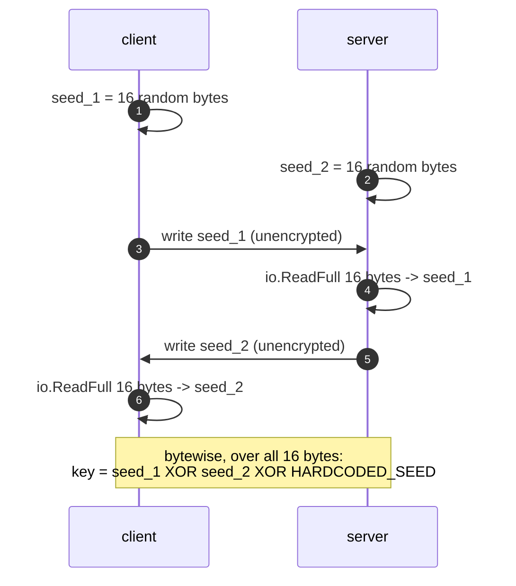
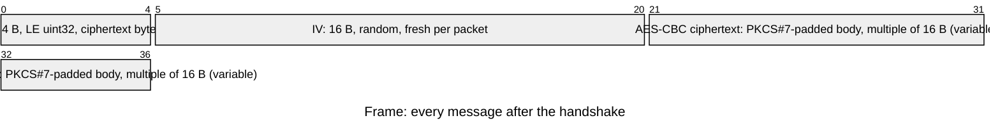
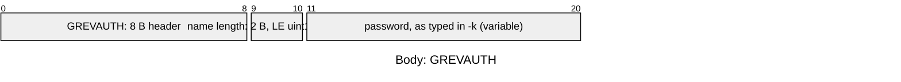
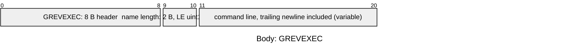
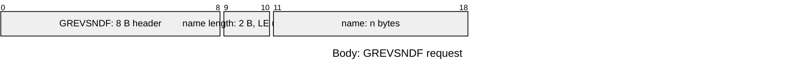
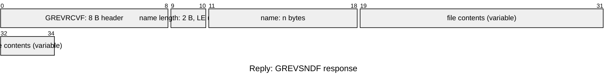

# grevshell

A barebones reverse shell in Go, written for educational purposes and authorized
security testing. A TCP listener executes commands and moves files; a separate
client drives the session over an AES-CBC encrypted channel keyed from a
two-way handshake and gated by a shared password. Both sides share one protocol
library (`grevcore`) so the framing can't drift apart.

---

## Legal Notice

**For educational purposes and authorized security testing only.** By
downloading, compiling, or running this software you agree that you will use it
**only on systems you own, or systems for which you have explicit, documented,
written authorization** from the owner — penetration tests, security
assessments, CTF competitions, malware analysis coursework, and isolated lab
environments. You will not use grevshell to access, modify, exfiltrate data
from, or damage any system or network without prior authorization. You accept
full and sole responsibility for your use of it, and the author and contributors
cannot be held liable for any misuse, damage, data loss, or unlawful activity.

Unlawful use of reverse shell software is a criminal offence in most
jurisdictions, and several penalize not just the intrusion but the
*production, provisioning, and use* of the tool itself. Commonly engaged laws:

- **Vietnam** — Criminal Code No. 100/2015/QH13 (as amended by Law
  No. 12/2017/QH14): Art. 286 (producing or **using** tools for unlawful
  purposes), Art. 289 (unlawfully infiltrating a computer or
  telecommunications network), Art. 290 (appropriation of property via a
  network). Also the Law on Prevention and Control of Cyber Attacks on
  Information Systems (2023), the Law on Network Security No. 86/2015/QH13, and
  the Law on Cybersecurity No. 116/2025/QH15 **Art. 7** (in force 1 July 2026),
  which prohibits cyberattacks and the production or use of tools to that
  effect.
- **United States** — Computer Fraud and Abuse Act (18 U.S.C. § 1030).
- **United Kingdom** — Computer Misuse Act 1990.

If you are unsure whether a use is authorized or lawful in your jurisdiction,
**stop and obtain written permission and qualified legal advice first.**
Authorization from the system owner is a minimum, not a safe harbour.

---

## Structure

Two binaries, one shared library. Everything that touches the wire — framing,
encryption, headers — lives in `grevcore`, so the two sides can't disagree about
the format.

| Path | Role |
| --- | --- |
| `main.go` | Server: flags, listener, authentication, packet dispatch |
| `grevclient/client.go` | Client: flags, authentication, prompt loop, directives |
| `grevcore/encryption.go` | Key derivation, AES encrypt/decrypt, error returns |
| `grevcore/headers.go` | The `Packet` struct and its 8-byte type tags |
| `grevcore/processing.go` | Length-prefixed send/receive framing, `Assemble`/`Disassemble` |

Every message on the wire is a `grevcore.Packet` — a header tag, a filename, and
a payload. `Assemble` and `Disassemble` (`grevcore/processing.go:68` and `:79`)
lay that struct out as bytes, so the three fields are present on *every* packet;
the filename field is simply empty for the packets that don't use it.

Nothing in `grevcore` logs. `AesEncrypt` and `AesDecrypt` return `error` and the
callers propagate it, so a failure in the crypto layer surfaces as a session
teardown rather than a `nil` packet that gets parsed anyway.

---

## Packet Structure

### 1. Handshake (plaintext, once per connection)

Both peers generate 16 random bytes, write their own seed, then read the
peer's. `DeriveKey` (`grevcore/encryption.go:18`) XORs the two seeds with a
hardcoded constant, so both sides land on the same key without ever sending it.



There is no challenge, no signature, and no verification: whatever arrives in
those 16 bytes is trusted blindly.

### 2. Framing

Every message after the handshake is a length-prefixed frame
(`grevcore/processing.go`). The length counts the ciphertext only — the IV
included — and is checked against `MaxPacketSize` (0xFFFF) on receipt.



The minimum well-formed frame is 32 bytes: a 16-byte IV plus one 16-byte
ciphertext block, and the minimum plaintext is 10 bytes — the header tag plus
the filename length. `AesDecrypt` (`grevcore/encryption.go:60`) rejects anything
that isn't a nonzero multiple of the AES block size before it touches the IV or
calls `CryptBlocks`, so a truncated or misaligned length is an error rather than
a slice-bounds panic. Malformed PKCS#7 padding is rejected the same way, by
`pkcs7pad.Unpad`. `Disassemble` then bounds-checks the plaintext, and
`ReceivePacket` passes all four failures — read, decrypt, unpad, parse —
straight back to the caller.

### 3. Bodies

Every body is the same three fields, laid out by `Packet.Assemble`
(`grevcore/processing.go:60`): an 8-byte ASCII header tag that selects the
operation, a length-prefixed filename, then the payload. Offsets below are byte
offsets; fields marked *(variable)* are drawn at an illustrative width. The
filename is genuinely length-prefixed and is read back off the wire, so a
packet is only ever interpreted as the tag its sender chose.

**`GREVAUTH` — client → server: password**



The client sends this immediately after the handshake, unprompted. The server
compares `Data` to its own `-k` with a plain `==` (`main.go:69`) and answers
with one of two packets:

| Reply header | Meaning |
| --- | --- |
| *(empty)* | Accepted — the session starts |
| `GREVFAIL` | Rejected — the client prints `Authentication Failed.` and exits |

**`GREVEXEC` — client → server: run a shell command**



The server runs it through `/usr/bin/sh -c`, merges stdout and stderr, and
replies with an **empty header** carrying the raw output — the client prints it
as-is.

**`GREVRCVF` — client → server: upload a file**


The server writes the contents to `filepath.Base(name)` with mode `0600` in its
own working directory, then replies with an empty, empty-bodied packet. A failed
write ends the session.

**`GREVSNDF` — client → server: download a file**



The server reads the name verbatim — no path filtering — and replies tagged
`GREVRCVF`, with the name echoed back plus the contents:



The client dispatches on that `GREVRCVF` tag to tell a download apart from a
command's output, then writes `filepath.Base(name)` locally.

**Unknown header — server → client:** an empty header carrying a single `?`
byte.

`/EXIT` is handled entirely client-side: it closes the connection and sends
nothing.

---

## Build

Requires Go 1.27.1+ and a POSIX-like host (the server executes `/usr/bin/sh`).

```bash
go mod download

go build -o grevshell .            # server / listener
go build -o client ./grevclient    # client / controller
go vet ./...
```

---

## Usage

Both binaries take flags. The server binds `0.0.0.0` on `-p` (`main.go:29`); the
client dials `-h`:`-p`, defaulting to `localhost:9999`
(`grevclient/client.go:23`). Both take the same `-k` password.

| Flag | Binary | Default | Meaning |
| --- | --- | --- | --- |
| `-p` | both | `9999` | Port |
| `-k` | both | *(empty)* | Authentication password |
| `-h` | client | `localhost` | Server address |

**1. Start the server:**

```bash
./grevshell -k hunter2
# INFO Reverse shell listening on port 9999.
```

(The startup log hardcodes `9999` regardless of `-p`.)

**2. Start the client in a second terminal:**

```bash
./client -k hunter2
# INFO Connecting to 127.0.0.1:9999.
```

The `-k` values must match or the client gets `GREVFAIL`, prints
`Authentication Failed.` and exits without a prompt. On success the client
prompts with the server's address. Anything that isn't a directive is executed
on the server and its output printed back:

```
127.0.0.1:9999 - $ id
uid=1000(user) gid=1000(user) groups=1000(user)
```

**3. Directives:**

| Directive | Effect |
| --- | --- |
| `/SEND <path>` | Read `<path>` on the client, write a copy into the server's working directory |
| `/GET <path>` | Read `<path>` on the server, save a copy in the client's working directory |
| `/CANCEL` | Send a literal `\x03` byte to the server |
| `/EXIT` | Close the session |

```
127.0.0.1:9999 - $ /SEND notes.txt
127.0.0.1:9999 - $ /GET /etc/hostname
127.0.0.1:9999 - $ /EXIT
```

Arguments are split on whitespace, so paths containing spaces can't be
transferred, and `/SEND` or `/GET` typed without an argument panics the client.

`/CANCEL` is inert as written: it fills in `Data` but leaves the header empty,
so the server falls through to the unknown-header case and answers `?`.

**4. End the session** with `/EXIT` or **Ctrl+C**. The server sees the dropped
connection, closes it, and returns to `Accept`. **Ctrl+D** does not work: the
client logs the read error and spins.

**5. Leave `-k` off the server at your own risk.** An empty server password
skips `ValidAuth` entirely, but the client still sends its `GREVAUTH` packet, so
the server treats it as an unknown header and the first line you see at the
prompt is a `?`.

---

## Security Notes

A teaching implementation, not a production implant. Before using it anywhere
resembling a real engagement:

- **Hardcoded key material.** The XOR seed is in the source (`HARDCODED_SEED`).
  There is no key exchange and no integrity protection, so anyone who observes
  the handshake can reconstruct the session key — and therefore read or forge
  the password. CBC without a MAC is malleable.
- **The password is the only gate, and it is optional.** `-k` on the server is a
  plain string comparison of one packet, with no replay protection and no
  lockout; omitting it makes the listener wide open. The listener binds
  `0.0.0.0`, so an unauthenticated build is an RCE endpoint for the whole
  network, not just loopback.
- **Authentication failures leak connections.** A rejected client is `continue`d
  without `conn.Close()` (`main.go:56`), and a `DeriveKey` failure returns from
  `main` entirely, killing the listener. Repeat failed logins exhaust file
  descriptors; one malformed handshake takes the server down.
- **Arbitrary file access.** `/GET` reads any path the server process can read
  and returns it verbatim. `/SEND` writes attacker-supplied content into the
  server's working directory — `filepath.Base` stops it escaping that directory,
  but nothing prevents overwriting an existing file there.
- **Whole file per packet, no chunking.** A transfer is read, padded, and
  buffered in memory as one packet, so it is bounded by `MaxPacketSize` (64 KiB)
  and larger files cannot be moved at all.
- **Every packet is bounds-checked.** `AesDecrypt` rejects a frame length that
  isn't a positive multiple of 16, `Unpad` refuses bad padding, and
  `Disassemble` rejects a plaintext shorter than the 10-byte fixed prefix or a
  declared filename length that overruns what arrived. Truncated frames,
  misaligned lengths, bad padding, and lying filename lengths are all errors
  now, so malformed input can no longer panic the process. The remaining
  weakness is upstream of the parser: anyone who can derive the key — which
  the hardcoded seed makes trivial — can still inject a well-formed packet.
- **Text mode only.** Input is read line by line; interactive programs, job
  control, and streaming output will not behave correctly.
- **One session at a time.** The server is single-threaded and serves a single
  connection until it drops, then accepts again.

Hardening exercises: mutual authentication, a KDF over the password, ECDH
instead of a hardcoded seed, AES-GCM for integrity, closing rejected
connections, bounds checks in `Disassemble`, chunked transfers, and command
allow-listing.

---

## To-Do

- [x] File download/upload (`/GET` and `/SEND`).
- [x] Length-prefixed filenames instead of a fixed 32-byte field.
- [x] Explicit `/EXIT` to end a session.
- [x] Password authentication (`-k` on both binaries).
- [x] Return errors from the crypto layer instead of logging and continuing.
- [x] Reject misaligned frame lengths and bad PKCS#7 padding.
- [x] Bounds-check the plaintext before `Disassemble` slices it.
- [x] Bounds-check the wire-supplied filename length against what arrived.
- [ ] Close rejected connections instead of leaking them.
- [ ] Chunk large files instead of one packet per file.
- [ ] Real cryptography.

---

## License

Released under the [ISC License](LICENSE) © 2026 Devobass.
