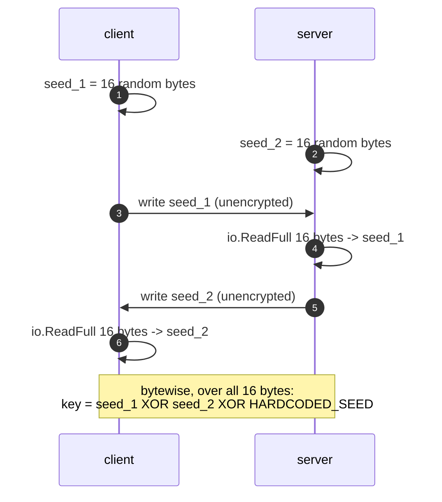
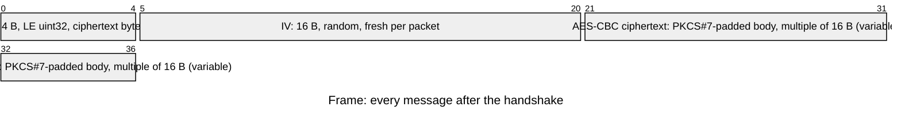
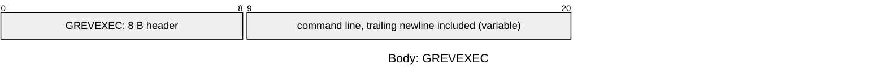
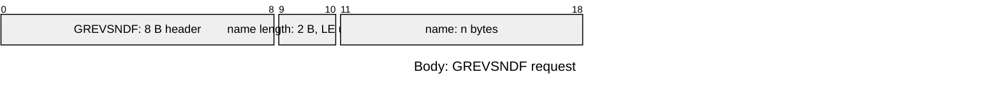
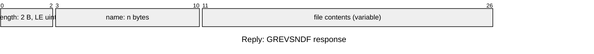

# grevshell

A barebones reverse shell in Go, written for educational purposes and authorized
security testing. A TCP listener executes commands and moves files; a separate
client drives the session over an AES-CBC encrypted channel keyed from a
two-way handshake. Both sides share one protocol library (`grevcore`) so the
framing can't drift apart.

---

## Legal Notice

**For educational purposes and authorized security testing only.** By
downloading, compiling, or running this software you agree that you will use it
**only on systems you own, or systems for which you have explicit, documented,
written authorization** from the owner — penetration tests, security
assessments, CTF competitions, malware analysis coursework, and isolated lab
environments. You will not use grevshell to access, modify, exfiltrate data
from, or damage any system or network without prior authorization. You accept
full and sole responsibility for your use of it, and the author and contributors
cannot be held liable for any misuse, damage, data loss, or unlawful activity.

Unlawful use of reverse shell software is a criminal offence in most
jurisdictions, and several penalize not just the intrusion but the
*production, provisioning, and use* of the tool itself. Commonly engaged laws:

- **Vietnam** — Criminal Code No. 100/2015/QH13 (as amended by Law
  No. 12/2017/QH14): Art. 286 (producing or **using** tools for unlawful
  purposes), Art. 289 (unlawfully infiltrating a computer or
  telecommunications network), Art. 290 (appropriation of property via a
  network). Also the Law on Prevention and Control of Cyber Attacks on
  Information Systems (2023), the Law on Network Security No. 86/2015/QH13, and
  the Law on Cybersecurity No. 116/2025/QH15 **Art. 7** (in force 1 July 2026),
  which prohibits cyberattacks and the production or use of tools to that
  effect.
- **United States** — Computer Fraud and Abuse Act (18 U.S.C. § 1030).
- **United Kingdom** — Computer Misuse Act 1990.

If you are unsure whether a use is authorized or lawful in your jurisdiction,
**stop and obtain written permission and qualified legal advice first.**
Authorization from the system owner is a minimum, not a safe harbour.

---

## Structure

Two binaries, one shared library. Everything that touches the wire — framing,
encryption, headers — lives in `grevcore`, so the two sides can't disagree about
the format.

| Path | Role |
| --- | --- |
| `main.go` | Server: listens, accepts, dispatches packets |
| `grevclient/client.go` | Client: prompt loop, directives, file transfer |
| `grevcore/encryption.go` | Key derivation and AES encrypt/decrypt |
| `grevcore/headers.go` | The 8-byte packet type tags |
| `grevcore/processing.go` | Length-prefixed send/receive framing |

---

## Packet Structure

### 1. Handshake (plaintext, once per connection)

Both peers generate 16 random bytes, write their own seed, then read the
peer's. `DeriveKey` (`grevcore/encryption.go:18`) XORs the two seeds with a
hardcoded constant, so both sides land on the same key without ever sending it.



There is no challenge, no signature, and no verification: whatever arrives in
those 16 bytes is trusted blindly.

### 2. Framing

Every message after the handshake is a length-prefixed frame
(`grevcore/processing.go`). The length counts the ciphertext only — the IV
included — and is checked against `MaxPacketSize` (0xFFFF) on receipt.



### 3. Bodies

A body always starts with an 8-byte ASCII header that selects the operation
(`grevcore/headers.go`). Offsets below are byte offsets. Fields marked
*(variable)* are drawn at an illustrative width; only the name field is
genuinely length-prefixed, and it is the only one read back off the wire.

**`GREVEXEC` — client → server: run a shell command**



The server runs it through `/usr/bin/sh -c`, merges stdout and stderr, and
replies with **raw output and no header** — the client prints it as-is.

**`GREVRCVF` — client → server: upload a file**


The server writes the contents to `filepath.Base(name)` with mode `0600` in its
own working directory. No reply; a failed write ends the session.

**`GREVSNDF` — client → server: download a file**



The server reads the name verbatim — no path filtering — and replies with the
name echoed back plus the contents, again **without a header**:



The client strips the echoed name and writes `filepath.Base(name)` locally.

**Unknown header — server → client:** a single `?` byte, also with no header.

`/EXIT` is handled entirely client-side: it closes the connection and sends
nothing.

---

## Build

Requires Go 1.27.1+ and a POSIX-like host (the server executes `/usr/bin/sh`).

```bash
go mod download

go build -o grevshell .            # server / listener
go build -o client ./grevclient    # client / controller
go vet ./...
```

---

## Usage

Both binaries currently listen/dial on `localhost:9999` (`main.go:20`,
`grevclient/client.go:17`) — edit the address in each file to change it.

**1. Start the server:**

```bash
./grevshell
# INFO Reverse shell listening on port 9999.
```

**2. Start the client in a second terminal:**

```bash
./client
# INFO Connecting to 127.0.0.1:9999.
```

The client prompts with the server's address. Anything that isn't a directive is
executed on the server and its output printed back:

```
127.0.0.1:9999 - $ id
uid=1000(user) gid=1000(user) groups=1000(user)
```

**3. Directives:**

| Directive | Effect |
| --- | --- |
| `/SEND <path>` | Read `<path>` on the client, write a copy into the server's working directory |
| `/GET <path>` | Read `<path>` on the server, save a copy in the client's working directory |
| `/EXIT` | Close the session |

```
127.0.0.1:9999 - $ /SEND notes.txt
127.0.0.1:9999 - $ /GET /etc/hostname
127.0.0.1:9999 - $ /EXIT
```

Arguments are split on whitespace, so paths containing spaces can't be
transferred, and `/SEND` or `/GET` typed without an argument panics the client.

**4. End the session** with `/EXIT` or **Ctrl+C**. The server sees the dropped
connection, closes it, and returns to `Accept`. **Ctrl+D** does not work: the
client logs the read error and spins.

---

## Security Notes

A teaching implementation, not a production implant. Before using it anywhere
resembling a real engagement:

- **Hardcoded key material.** The XOR seed is in the source (`HARDCODED_SEED`).
  There is no key exchange, no authentication, and no integrity protection, so
  anyone who observes the handshake can reconstruct the session key. CBC without
  a MAC is malleable.
- **No authentication.** Any host that reaches the listener can issue commands
  *and* move files. The listener binds to loopback by default; rebinding it
  exposes an unauthenticated RCE endpoint to your network.
- **Arbitrary file access.** `/GET` reads any path the server process can read
  and returns it verbatim. `/SEND` writes attacker-supplied content into the
  server's working directory — `filepath.Base` stops it escaping that directory,
  but nothing prevents overwriting an existing file there.
- **Whole file per packet, no chunking.** A transfer is read, padded, and
  buffered in memory as one packet, so it is bounded by `MaxPacketSize` (64 KiB)
  and larger files cannot be moved at all.
- **Unsliced packets panic.** The server slices the first 8 bytes of every
  plaintext without checking the length, so a short packet crashes the process.
- **Text mode only.** Input is read line by line; interactive programs, job
  control, and streaming output will not behave correctly.
- **One session at a time.** The server is single-threaded and serves a single
  connection until it drops, then accepts again.

Hardening exercises: mutual authentication, ECDH instead of a hardcoded seed,
AES-GCM for integrity, bounds checks on every slice, chunked transfers, and
command allow-listing.

---

## To-Do

- [x] File download/upload (`/GET` and `/SEND`).
- [x] Length-prefixed filenames instead of a fixed 32-byte field.
- [x] Explicit `/EXIT` to end a session.
- [ ] Chunk large files instead of one packet per file.
- [ ] Authentication.
- [ ] Real cryptography.

---

## License

Released under the [ISC License](LICENSE) © 2026 Devobass.
