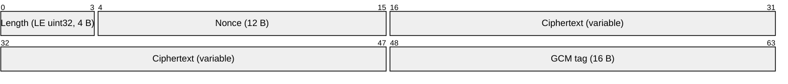
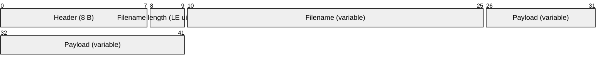

# grevshell

A barebones, educational reverse shell written in Go. A TCP server executes commands and moves files; a client drives the session through an authenticated, encrypted channel. Both sides share one protocol library (`grevcore`).

> **PoC for the Malware Engineering course at UIT. Intended for isolated labs and authorized testing only.**

---

## Legal Notice

**For educational purposes and authorized security testing only.** By downloading, compiling, or running this software you agree that you will use it **only on systems you own, or systems for which you have explicit, documented, written authorization** from the owner — penetration tests, security assessments, CTF competitions, malware analysis coursework, and isolated lab environments. You will not use grevshell to access, modify, exfiltrate data from, or damage any system or network without prior authorization. You accept full and sole responsibility for your use of it, and the author and contributors cannot be held liable for any misuse, damage, data loss, or unlawful activity.

Unlawful use of reverse shell software is a criminal offence in most jurisdictions, and several penalize not just the intrusion but the **production, provisioning, and use** of the tool itself. Commonly engaged laws:

- **Vietnam** — Criminal Code No. 100/2015/QH13 (as amended by Law No. 12/2017/QH14): Art. 286 (producing or **using** tools for unlawful purposes), Art. 289 (unlawfully infiltrating a computer or telecommunications network), Art. 290 (appropriation of property via a network). Also the Law on Prevention and Control of Cyber Attacks on Information Systems (2023), the Law on Network Security No. 86/2015/QH13, and the Law on Cybersecurity No. 116/2025/QH15 **Art. 7** (in force 1 July 2026), which prohibits cyberattacks and the production or use of tools to that effect.
- **United States** — Computer Fraud and Abuse Act (18 U.S.C. § 1030).
- **United Kingdom** — Computer Misuse Act 1990.

If you are unsure whether a use is authorized or lawful in your jurisdiction, **stop and obtain written permission and qualified legal advice first.** Authorization from the system owner is a minimum, not a safe harbour.

---

## Layout

| Path | Role |
| --- | --- |
| `main.go` | Server: flags, TCP listener, key exchange, packet dispatch, command execution |
| `grevclient/client.go` | Client: flags, key exchange, prompt loop, directives |
| `grevcore/encryption.go` | X25519 ECDH, HKDF-SHA512 key derivation, key confirmation, AES-GCM |
| `grevcore/headers.go` | `Packet` struct, header tags, size constants |
| `grevcore/processing.go` | Length-prefixed send/receive, `Assemble`/`Disassemble` |

---

## Protocol

### 1. Key exchange (plaintext, once)

Both peers run `ExchangeKey` symmetrically:

1. Each side generates an ephemeral **X25519** key pair and sends its 32-byte public key.
2. Each computes the shared secret with its private key and the peer's public key.
3. The shared secret is run through **HKDF-SHA512**, using the shared password `psk` as the salt, to derive a **16-byte AES key**.
4. Each side sends `SHA-512(key)` and compares it with the hash received from the peer (`KeysMatch`). A mismatch — e.g. a wrong password — aborts the session.

The password is never sent over the wire. It is mixed into the KDF, so an attacker without it derives a different key and cannot pass confirmation.

### 2. Framing

After the handshake every message is a 4-byte little-endian length followed by the AES-GCM blob:



AES-GCM output is laid out as `12-byte nonce || ciphertext || 16-byte tag`. The encrypted blob is capped at **65535 bytes** (`MaxPacketSize`); longer packets are rejected.

### 3. Packet body

The plaintext inside the AES-GCM blob is:



Headers: `GREVEXEC` (run a command), `GREVRCVF` (file upload, server receives), `GREVSNDF` (file download, server sends). The filename field is empty for command packets.

---

## Build

Requires **Go 1.27+** on a POSIX host (the server shells out to `/usr/bin/sh`).

```bash
go mod download
go build -o grevshell .             # server
go build -o client ./grevclient     # client
go vet ./...
```

---

## Usage

| Flag | Binary | Default | Meaning |
| --- | --- | --- | --- |
| `-p` | both | `9999` | Port |
| `-k` | both | `password123` | Shared authentication password |
| `-h` | client | `localhost` | Server address |

The server binds `0.0.0.0`; the client connects to `-h`:`-p`.

```bash
# server (victim side)
./grevshell -k hunter2

# client (operator side)
./client -h 10.0.0.5 -k hunter2
```

At the `client` prompt:

| Directive | Effect |
| --- | --- |
| `/SEND <path>` | Upload a local file to the server's working directory |
| `/GET <path>` | Download a file from the server to the client's working directory |
| `/EXIT` | Close the session |
| *(anything else)* | Executed on the server via `/usr/bin/sh -c` |

Received files are written using only the base name, with mode `0600`, into the current directory.

---

## Security Notes

Teaching implementation, **not** a hardened or stealthy implant.

- **Key confirmation is plaintext.** `KeysMatch` sends `SHA-512(key)` in the clear, exposing a hash of the session key and allowing it to be replayed. An active man-in-the-middle cannot derive the real key without the password, but the confirmation step itself is not protected.
- **No chunking.** The 64 KiB packet cap limits command output and file transfers.
- **Arbitrary file access.** `/GET` reads any path the server process can read; `/SEND` overwrites any writable path relative to the server's cwd. Paths are reduced to their base name on write, but traversal on read is unrestricted.
- **Single session.** The accept loop handles one client at a time; `ExecuteRequest` blocks until that connection ends.
- **No TTY / job control.** Commands run non-interactively with stdout and stderr merged; interactive programs will not behave as expected.
- **No process detachment.** The server is a normal foreground process with no persistence or evasion.

Possible hardening (not implemented): command allow-listing, mutual authentication tied to the key confirmation, chunked transfers, per-connection goroutines, and a PTY wrapper.

---

## TODO

- [x] Authentication.
- [x] Real cryptography (AES-GCM).
- [x] Authenticated key exchange (X25519 + HKDF-SHA512).
- [x] File upload/download (`/SEND`, `/GET`).
- [x] Length-prefixed filenames.
- [x] Explicit `/EXIT`.
- [ ] Chunk large files instead of one packet per file.
- [ ] Handle concurrent sessions.

---

## License

Released under the [ISC License](LICENSE) © 2026 Devobass.
